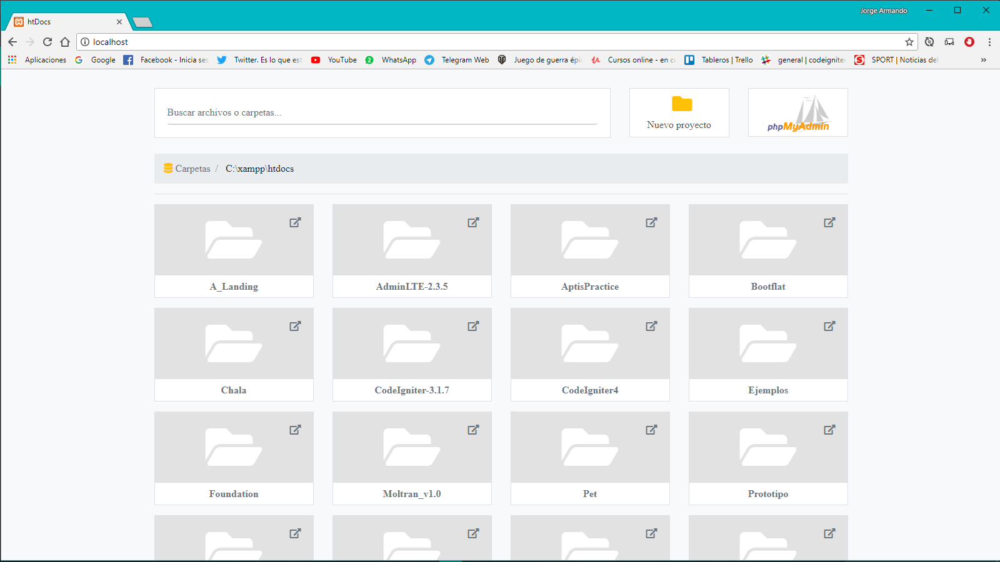
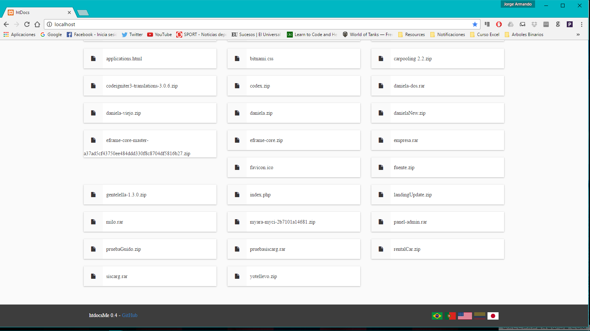
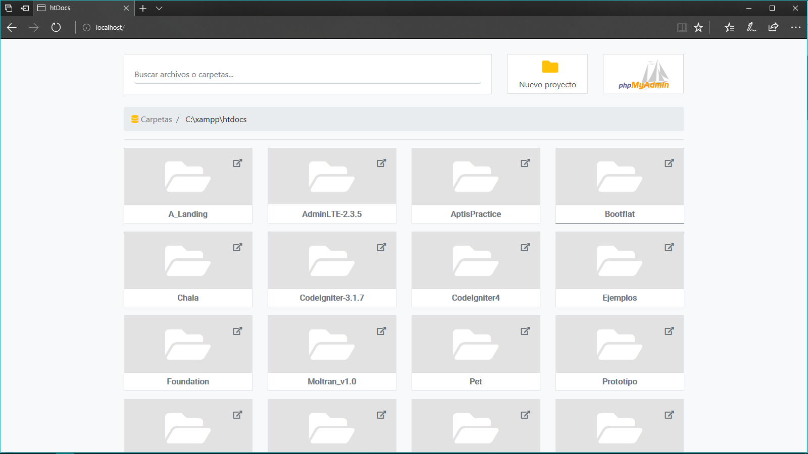
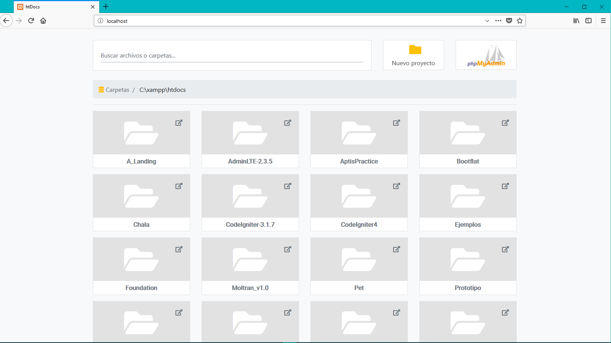
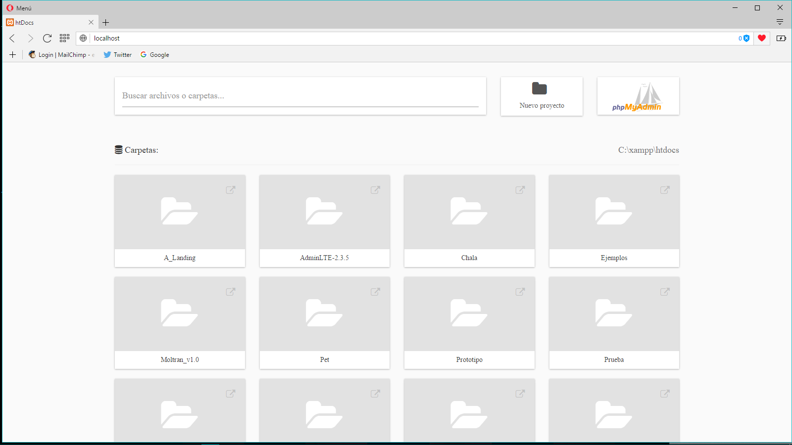

# **htdocsMe**

[Español]
Un launcher minimalista para la carpeta raíz de nuestro servidor xampp/lampp.

[English]
A minimalist launcher for the root folder of our xampp / lampp server.

[Português]
Um lançador minimalista para a pasta raiz do xampp / lampp

## Uso/Usage/Utilização ##
[Español]
Simplemente copia el archivo index.php en el directorio raíz de xampp (Normalmente es htdocs, por eso el nombre)

[English]
Simply copy the index.php file in the root directory of xampp (typically htdocs, hence the name)

[Português]
Basta copiar o arquivo index.php no diretório raiz do xampp (normalmente htdocs, daí o nome)

## Traducciones/Translations/Traduções:
Português - por Manuel Santos y Eduardo Kraus
English - By Eduardo Kraus

## Screenshoots ##

