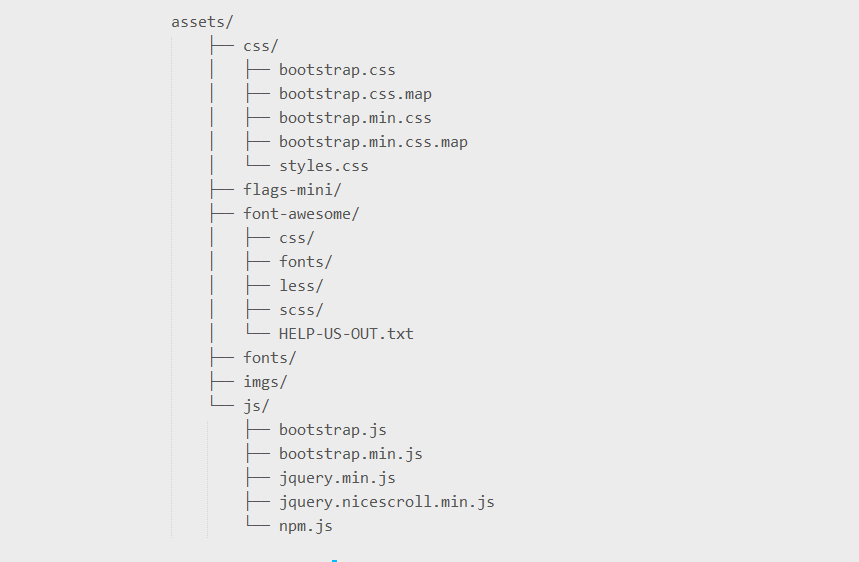
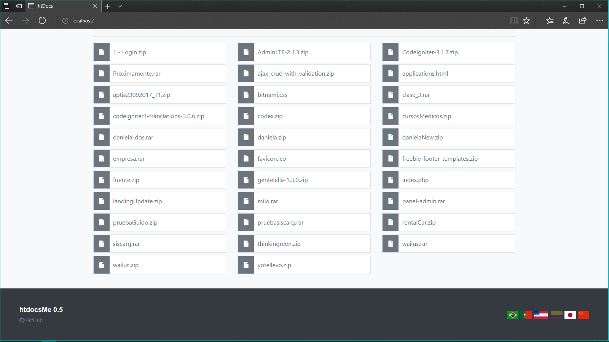
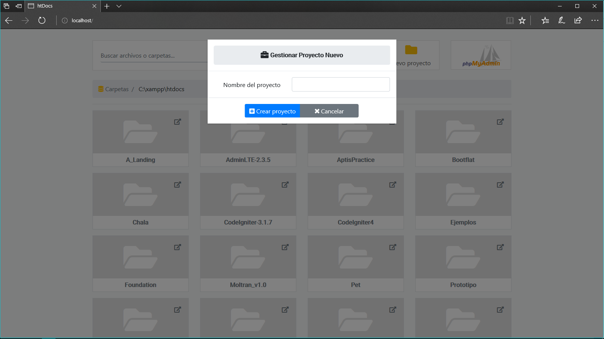

# **htdocsMe**

Componentes o librerias necesarias y usadas en este performance: 
- Bootstrapp: Es un kit de herramientas de código abierto para desarrollar con HTML, CSS y JS. {v4}
  - https://getbootstrap.com/
- Font Awesome: Conjunto de iconos de vectores, logotipos sociales y herramientas más populares de la Web. {v5.0.10}
  - https://fontawesome.com/
- jQuery: es una biblioteca de JavaScript rápida, pequeña y rica en funciones. {v3.3.1}:
  - https://jquery.com/
- jQuery.nicescroll: Es un plugin para barras de desplazamiento personalizadas en navegadores móviles y de escritorio. {v3.7.6}
  - https://nicescroll.areaaperta.com/

[Español]
Un launcher minimalista para la carpeta raíz de nuestro servidor Xampp/Lampp.

[English]
A minimalist launcher for the root folder of our Xampp/Lampp server.

[Português]
Um lançador minimalista para a pasta raiz do Xampp/Lampp

## Uso/Usage/Utilização ##
Simplemente copia el archivo index.php y la carpeta 'assets' en el directorio raíz de xampp (Normalmente es htdocs, por eso el nombre).

Simply copy the file index.php and the folder 'assets' in the root directory of xampp (Normally it's htdocs, that's why the name).

Basta copie o arquivo index.php e a pasta 'assets' no diretório raiz do xampp (normalmente é htdocs, é por isso que o nome).

## Qué incluye?/What includes?/Que inclui?
Dentro de la descarga encontrará los siguientes directorios y archivos, agrupando de forma lógica activos comunes y proporcionando variaciones compiladas y minificadas. Verás algo como esto:

Within the download you'll find the following directories and files, logically grouping common assets and providing both compiled and minified variations. You'll see something like this:

Dentro o download, você encontrará os seguintes diretórios e arquivos, logicamente agrupar ativos comuns e fornecendo compilado e minified Ambas as variações. Você verá algo como isto:

## Traducciones/Translations/Traduções:
Português - por Manuel Santos y Eduardo Kraus
English - By Eduardo Kraus

## Capturas de pantalla/Screenshoots/Screenshots ##

