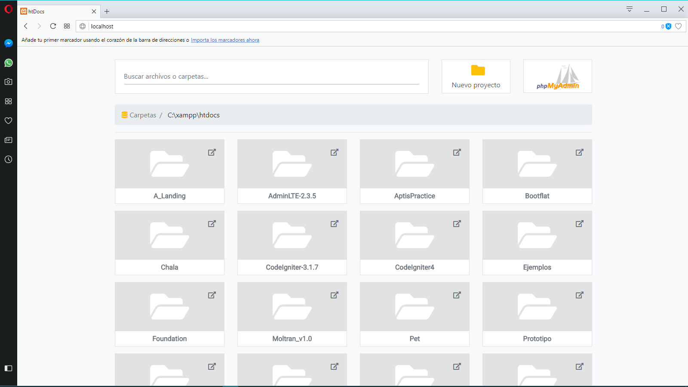

# **htdocsMe**

[Español]
Un launcher minimalista para la carpeta raíz de nuestro servidor xampp/lampp.

[English]
A minimalist launcher for the root folder of our xampp / lampp server.

[Português]
Um lançador minimalista para a pasta raiz do xampp / lampp

## Uso/Usage/Utilização ##
Simplemente copia el archivo index.php en el directorio raíz de xampp (Normalmente es htdocs, por eso el nombre)

Simply copy the index.php file in the root directory of xampp (typically htdocs, hence the name)

Basta copiar o arquivo index.php no diretório raiz do xampp (normalmente htdocs, daí o nome)

## Qué incluye?/What includes?/Que inclui?
Dentro de la descarga encontrará los siguientes directorios y archivos, agrupando de forma lógica activos comunes y proporcionando variaciones compiladas y minificadas. Verás algo como esto:

Within the download you'll find the following directories and files, logically grouping common assets and providing both compiled and minified variations. You'll see something like this:

Dentro o download, você encontrará os seguintes diretórios e arquivos, logicamente agrupar ativos comuns e fornecendo compilado e minified Ambas as variações. Você verá algo como isto:

## Traducciones/Translations/Traduções:
Português - por Manuel Santos y Eduardo Kraus
English - By Eduardo Kraus

## Screenshoots ##

